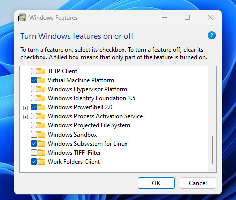
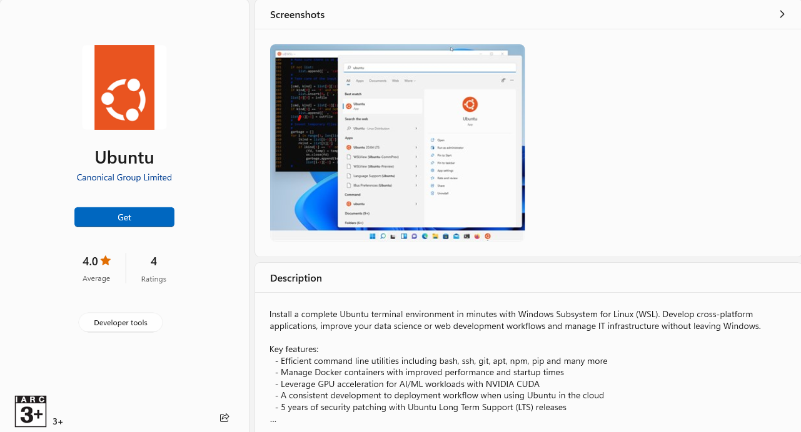
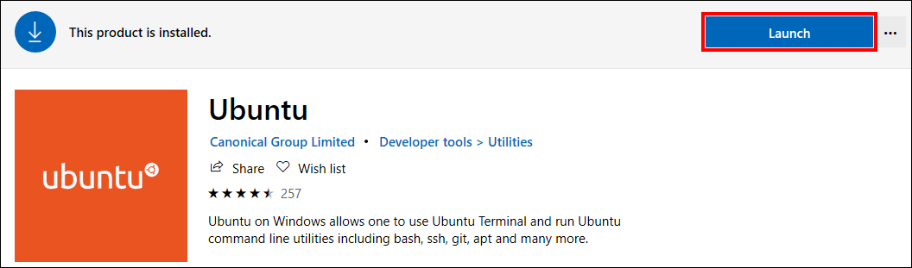
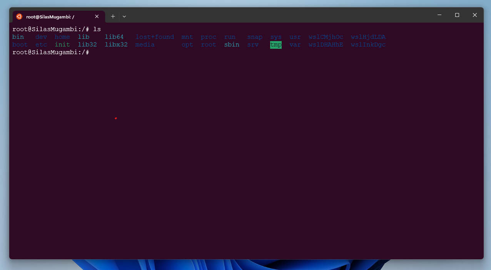
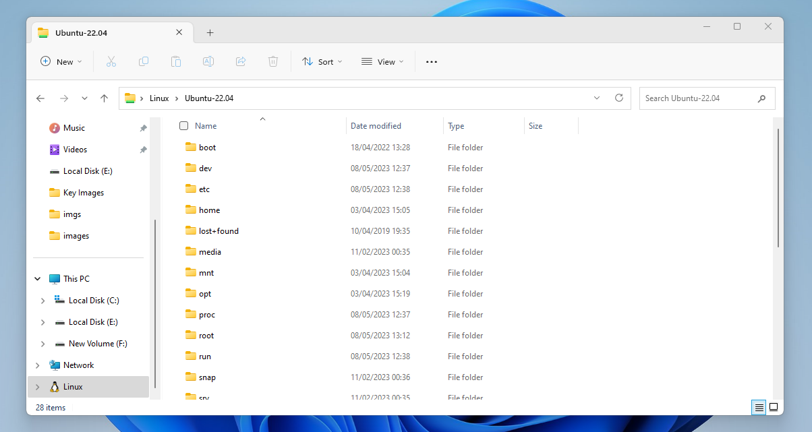

# Setting Up Ubuntu Subsystem in Windows

This repository contains a step-by-step guide on how to set up Ubuntu Subsystem on a Windows machine.
 - The Ubuntu Subsystem allows you to run Linux commands and tools directly from your Windows machine using the Ubuntu terminal.

    

 - The Ubuntu Subsystem allows you to run Linux commands and tools directly from your Windows machine, making it a valuable tool for developers and IT professionals.

## Prerequisites

Before you begin, make sure that your Windows machine meets the following requirements:

- Windows 10 version 16215.0 or later:
    - You can check your Windows version by typing `winver` in the search bar and pressing Enter.
    - If your version is earlier than 16215.0, you will need to update your Windows operating system to the latest version.


- 64-bit version of Windows:
    - You can check whether your Windows is 64-bit by going to `Settings` > `System` > `About` and looking under the `Device specifications` section.


- A Windows Insider account (optional, but recommended for the latest updates):
    - If you want to receive the latest updates for the Ubuntu Subsystem, you can sign up for a Windows Insider account.

## Step-by-Step Guide

Follow these steps to set up Ubuntu Subsystem on your Windows machine:

1. Open the Windows Start menu and type `Windows Features` in the search bar. Click on `Turn Windows features on or off` in the search results.

    

2. In the `Windows Features` window, scroll down and locate `Windows Subsystem for Linux` in the list of features. Check the box next to it and click `OK` to start the installation process.

  - Run this command on your terminal

    ```bash
    wsl --install
    ```

  - Change the default Linux distribution installed

    ```bash
    wsl --install -d <Distribution Name>
    ```

  - Replace <`Distribution Name`> with the name of the distribution you would like to install.
  - To see a list of available Linux distributions available for download through the online store, enter:

      ```bash
      wsl --list --online
      ```

      OR

      ```bash
      wsl -l -o
      ```

  - To install additional Linux distributions after the initial install, you may also use the command

      ```bash
      wsl --install -d <Distribution Name>
      ```

      

3. Wait for the feature to install. This may take a few minutes.

4. After installation, open the Microsoft Store app on your computer.

5. Search for `Ubuntu` in the search bar and select `Ubuntu` from the search results.

    

6. Click the `Get` button to download and install Ubuntu on your Windows machine.

7. Once the installation is complete, launch the Ubuntu app from the Start menu. Wait for Ubuntu to initialize and set up the necessary components.

    

8. Enter a username and password to set up your Ubuntu account. This will be your account for the Ubuntu subsystem, separate from your Windows account.

9. Ubuntu subsystem is now set up and ready to use on your Windows machine. You can access it by launching the Ubuntu app or by opening a Windows terminal and typing `ubuntu`.

    

10. Update your installed software by running the `apt-get` command in Ubuntu. For other Linux distributions, refer to their documentation on software updates. Use the command below to update the package lists with sudo privileges:

    ```bash
    sudo apt-get update
    ```
 - note that you must use `sudo` and enter your password to run the command as an administrator.

 11. Finally, run this command to check dependencies and delete obsolete packages from the system (depending on how long the previous step took, you may have to enter our password again):

    ```bash
    sudo apt-get dist-upgrade
    ```

    
## Conclusion

With these simple steps, you can easily set up Ubuntu Subsystem on your Windows machine and enjoy the benefits of Linux commands and tools directly from your Windows terminal. If you encounter any issues during the installation process, feel free to refer to the troubleshooting guide in this repository.
